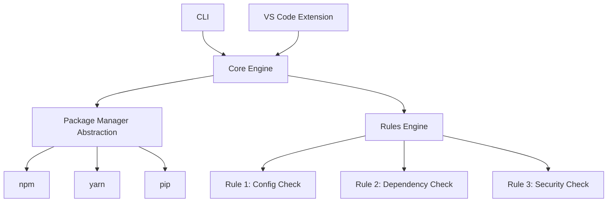

# Deploy Doctor System Plan

## Overview
Deploy Doctor is a diagnostic tool for software deployment readiness. It analyzes project configurations, dependencies, and code to identify potential deployment issues and provide actionable recommendations.

## Key Components

### 1. Core Engine
The central component that orchestrates the analysis process. It:
- Detects the project type and package manager
- Loads and executes rules
- Collects results and generates reports
- Provides a unified API for different interfaces (CLI, VS Code)

### 2. Package Manager Abstraction
A layer that abstracts interactions with different package managers:
- npm/yarn/pnpm for JavaScript/Node.js
- pip/poetry for Python
- maven/gradle for Java
- etc.
Provides methods to:
- Get project metadata (name, version, dependencies)
- Check for outdated packages
- Run package manager commands

### 3. Rules Framework
A plugin system for modular checks. Each rule:
- Implements a standard interface
- Performs specific validations
- Returns issues with severity levels and suggestions
Built-in rules could include:
- Missing environment variables
- Insecure dependencies
- Large bundle sizes
- Missing CI/CD configurations

### 4. CLI
Command-line interface that:
- Accepts project path as argument
- Runs the core engine
- Outputs results in various formats (console, JSON, etc.)
- Supports configuration options

### 5. VS Code Extension
IDE integration that:
- Provides real-time diagnostics
- Shows issues in the problems panel
- Offers quick fixes where possible
- Integrates with VS Code's language server protocol

## Architecture Diagram

## Implementation Plan

1. Define system requirements and high-level architecture ✓
2. Set up project directory structure and initial files
3. Implement package manager abstraction layer
4. Implement core engine for running checks
5. Implement rules framework and plugin system
6. Implement initial set of rules
7. Implement CLI interface
8. Implement VS Code extension
9. Add two additional rules (e.g., dependency updates and security checks)
10. Package VS Code extension for marketplace

## Additional Rules to Add
- Rule for checking outdated dependencies
- Rule for detecting security vulnerabilities in dependencies

## Marketplace Packaging
- Build the VS Code extension package
- Prepare metadata for VS Code Marketplace
- Ensure proper licensing and documentation